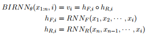

# Deep multi task learning with low level tasks supervised at lower levels

By Anders Sogaard from University of Copenhagen

## Abstract
- Earlier all task supervisions were on the same layer. 
- The major contribution of this paper is that if there is a hierarchy present in the tasks that are being done.
- The performance can be improved by using a similar hierarchy in the network. So, supervise the lower level tasks at lower layers.

## Model
- Task: Sequence tagging using deep BiLSTM
### Deep bi-RNNs
- LSTMs are used as a black box function which converts a input x1..n to output vector hn. 
- The output vector hn can be thought to be conditioned on the input x1..n
- biRNN can be best summarized as above.

- The vector vi - BIRNN(x1..n) is then a representation of the ith item in x1..n taking into account both the entire history x1..i and the future xi..n.
- Finally in a deep bi RNN, both RNNF RNNR are k-layered RNNs.

### Greedy sequence tagging with deep bi-RNNs
- In a sequence tagging task, we are given an input
w1, · · · , wn and need to predict an output
y1, · · · , yn, yi ∈ [1, · · · , |L|], where L is a label
set of interest; i.e., in a POS tagging task, L is
the part-of-speech tagset, and yi
is the pos-tag for
word wi
.
- If we take the inputs x1:n to correspond to a
sequence of sentence words w1, · · · , wn, we can
think of vi = BIRNN(x1:n, i) as inducing an in-
finite window around a focus word wi.

- We can then use vi as an input to a multiclass classification
function f(vi), to assign a tag yˆi to each input
location i.
- The tagger is greedy: the tagging decisions
are independent of each other. 
- However, as shown below and in other recent work using
bi-RNNs for sequence tagging, we can still produce
competitive tagging accuracies, because of
the richness of the representation vi
that takes the entire input sequence into account.

- For a k-layer bi-RNN tagger we get:

tag(w1:n, i) = ˆyi = f(vki)

vki = BIRNNk(x1:n, i)

x1:n = E(w1), E(w2), · · · , E(wn)

where E as an embedding function mapping each
word in the vocabulary into a demb-dimensional
vector, and vki
is the output of the k-th BIRNN layer
as defined above.

### MLP in deep bi RNNs
- The tasks although different have a common substructure.
- We can share the substructure eg. word embeddings etc.
- This is done by sharing biRNN part of the network but training specialized classification tagger for each task t.

### Multi task training protocol
- Alternate training
- At each step, we choose a random task and a random training example. The input is the same for all the tasks but the output labels are task specific.
- We then use tagger to predict the label and back propagate till level l(t). That is for all the parameters above the level containing the tagger layer are not updated.

### Implementation details
-  The classifiers ft() take the form
of a linear transformation followed by a softmax
ft(v) = arg maxi sof tmax(W(t)v+b
t
)[i], where
the weights matrix W(t)
and bias vector b
(t)
are
task-specific parameters.
- Cross entropy loss is used
- Back propagation with SGD, batch size 1 and default learning rate. 
- Senna embeddings and Polyglot embeddings
- Tasks: Chunking, POS, CCG 

## Results

## Notes
- MTL only works if the tasks are sufficiently similar
- Rademacher complexity is the ability of models
to fit random noise. Using the supervision at lower layers, Rademacher complexity is higher.

