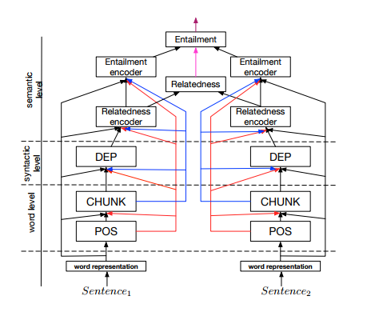
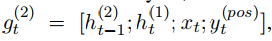
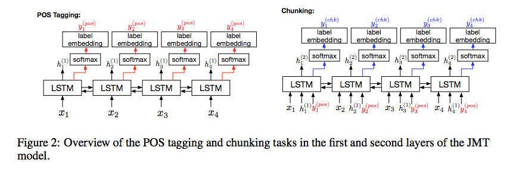
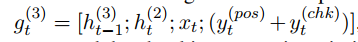
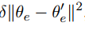
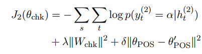
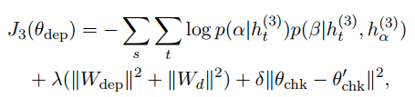
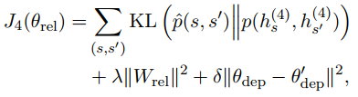

# A Joint Many-Task Model: Growing a Neural Network for Multiple NLP Tasks

By Salesforce guys: **Kazuma Hashimoto

## Abstract
- For end-to-end training of 5 tasks : POS tagging, chunking, dependency parsing, semantic relatedness, and textual entailment
-  Higher layers include
shortcut connections to lower-level
task predictions to reflect linguistic hierarchies.
- predicts increasingly
complex NLP tasks at successively deeper layers.
- motivated by Søgaard and
Goldberg (2016) who showed that predicting two
different tasks is more accurate when performed in
different layers than in the same layer
- Contribution: many tasks for joint training, lower level tasks improvement with the higher level tasks.

## Embeddings
- Word embeddings: skip gram to train word embedding matrix shared across all tasks. For unknown tokens, only one token UNK
- Character n-gram embeddings: USing same skip gram objective function.final character embedding
is the average of the unique character n-gram
embeddings of wt
. For example, the character ngrams
(n = 1, 2, 3) of the word “Cat” are {C, a,
t, #B#C, Ca, at, t#E#, #B#Ca, Cat, at#E#}
- Each word is then represented as xt by concatenating the word and character embeddings.
 ## Model
 - Word level task: POS tagging
    - Bi direction LSTM
    - input: word embeddings, hidden states from the same layer but previous time(ht-1) as showm in the image below.
    - The weights of the forward and backward LSTMs are concatenated and placed in the word representation of wt.
    - Simple softmax and relu is used for tagging POS
 - Word level task: Chunking
    - Tags/specifies region of major phrases in sentence.
    - Bi direction LSTM 
    - Input : output of first layer, hidden states from the same layer but previous time (its a LSTM!)
       - word embeddings
       - 
 
- Syntactic task : Dependency parsing
   - Identifies syntactic relationships(such as adjective modifying a noun) between a pair of words in a sentence. 
   - Bi direction LSTM
   - Input : word embeddings, outputs from the last 2 layers, hidden states from the same layer but previous time.
     - 
   - Predict the parent node for every word in a sentence using matching function between word wt and the candidates of the parent node as m(t,j) = htT Wdhj, where Wd is the parameter matrix.
   - standard bi LSTM + softmax and relu for dependency label which is then used in the calculation of the probability of a word being a parent.
   - By now we have 3 layers of bi LSTM
   
- Semantic task: semantic relatedness
  - aka relatedness of 2 sentences.
  - Input: Use the forth bi LSTM layers which captures the semantic representation of the sentences.
  - output is a real valued relatedness score.
  - This task is very similar to the textual entailment task since if the semantic relatedness is low, the 2 sentences are unlikely to entail each other.
  - sentence level representation: using max pooling of the word representations.
  - semantic relatedness is calculated by concatenating element wise subtraction and element wise multiplication.
  
- Semantic task: Textual entailment
  - aka compares 2 sentences and tells if one sentence is the premise and other the hypothesis, then do the premise entails the hypothesis.
  - max pooling as in the last layer
  - use softmax on the element wise subtraction.

## Training
- Pre training word representations:
  - pre train the word embeddings using skip gram model with negative sampling. Pre train char n-gram skip gram. 
  - fine tune when used in the final model.
  
- Training POS Layer:
  - cross entropy loss and L2 regularization
  - interesting is the successive L2 regularization term which is used to take into account the information learnt from other tasks
     
  - {\theta_e} is the current embedding, {\theta_e}' is the final embedding after training the final task in teh top most layer at previous training epoch.
   
   
- Training chunking layer:
 
 
- Training sentence relatedness
 
  
   
   
   
