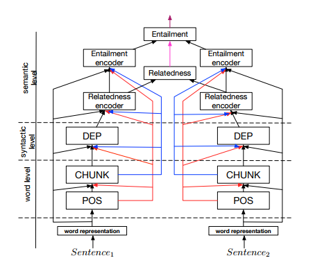

# A Joint Many-Task Model: Growing a Neural Network for Multiple NLP Tasks

By Salesforce guys: **Kazuma Hashimoto

## Abstract
- For end-to-end training of 5 tasks : POS tagging, chunking, dependency parsing, semantic relatedness, and textual entailment
  -  Higher layers include
shortcut connections to lower-level
task predictions to reflect linguistic hierarchies.
 - predicts increasingly
complex NLP tasks at successively deeper layers.
 - motivated by Søgaard and
Goldberg (2016) who showed that predicting two
different tasks is more accurate when performed in
different layers than in the same layer

## Embeddings
- Word embeddings: skip gram to train word embedding matrix shared across all tasks. For unknown tokens, only one token UNK
- Character n-gram embeddings: USing same skip gram objective function.final character embedding
is the average of the unique character n-gram
embeddings of wt
. For example, the character ngrams
(n = 1, 2, 3) of the word “Cat” are {C, a,
t, #B#C, Ca, at, t#E#, #B#Ca, Cat, at#E#}
 ## Model
 - First layer : Bi direction LSTM for POS tagging
  - input: word embeddings
 - Second Layer: Bi direction LSTM for chunking
  - Input : output of first layer
    - word embeddings
