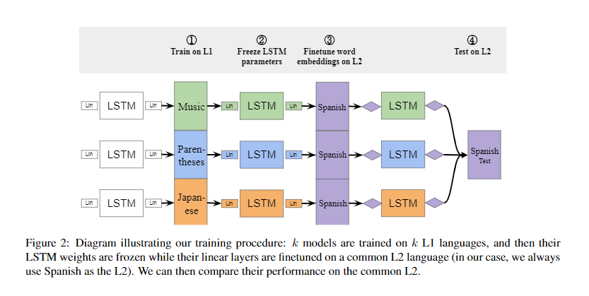

[https://arxiv.org/pdf/2004.14601.pdf]

## Notes:
- How do these sytems give rise to syntax?
- This paper : probes the structural features encoded in language model by evaluating its ability to leverage them for transfer across languages and data types like music etc.
- Train LM on multiple types of data and then test on language to see what type of data generalizes the best for the language.
- Finding the representations that work the best across languages.
- The test for the generalizability is done by the following:

- The various training schemes done were:

## What is interesting is that 
- the last two experiments with two types of parenthesis lead to similar results. As in even when there was no hierarchy in the second set of paranthesis based lang, it was enough for the model to learn that what starts and the same token ends.
- The music, lang, paranthesis, code were all better than random distribution or Zipfian distribution which demonstrates that the similar vocab is far less important than the structure of that language. Code gave better results than music as perhaps it is more closer to language.
